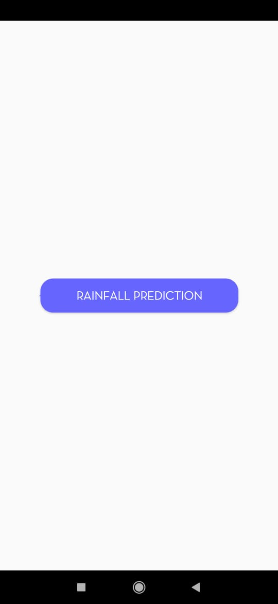
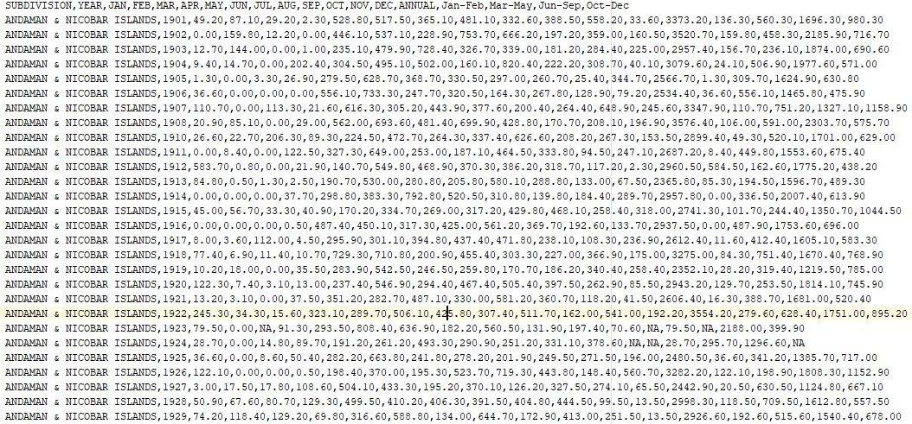

# SaiPredictionAlgorithm

This project is a Rainfall Prediction Algorithm using Random Forest Regression deployed as an Android App. The dataset consist data from 1901-2015 of all the states and union territories of all months and cycle of months(ex: jan-feb).

